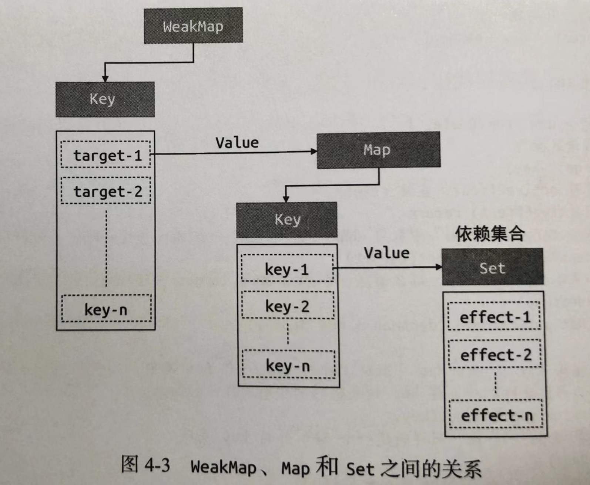

# vue.js 设计与实现

## 第二篇 响应系统的作用与实现

### 2022-05-02~2022-05-03

#### 第4章：响应系统的作用与实现

- 4.2 设计一个完善的响应系统

微响应式函数存在的问题：
  - 副作用函数硬编码，缺少灵活性
  - 当新设置的字段不存在时，匿名副作用函数也会执行
  - Set数据结构作为存储副作用函数的"桶"，是影响副作用函数与目标字段之间没有建立联系的根本原因。

解决方案：
  - 使副作用函数与被操作字段之间建立联系, weakMap代替Set方法;
    > WeakMap 对象是一组键/值对的集合，其中的键是弱引用的。其键必须是对象，而值可以是任意的。

  - WeakMap 由 target --> **Map** 构成， Map的键是原始对象 target 的 key;
  - Map 由 key --> **Set** 构成, Map值由副作用函数组成的**Set**集合




### 知识拓展

[WeakMap](https://developer.mozilla.org/zh-CN/docs/Web/JavaScript/Reference/Global_Objects/WeakMap) <br/>
[Set](https://developer.mozilla.org/zh-CN/docs/Web/JavaScript/Reference/Global_Objects/Set)  <br/>
[Map](https://developer.mozilla.org/zh-CN/docs/Web/JavaScript/Reference/Global_Objects/Map)  <br/>
 


### 2022-04-30

第4章：响应系统的作用与实现

- 4.1 响应式与副作用函数
  - 副作用函数: 函数执行会影响外部的未知或者全局变量的变化
  - 响应式数据的基本实现: 简版响应式函数
  - Set 方法实现
    > Set 对象允许你存储任何类型的唯一值，无论是原始值或者是对象引用。

[Set-MDN](https://developer.mozilla.org/zh-CN/docs/Web/JavaScript/Reference/Global_Objects/WeakMap)


## 第一篇 框架设计概览

### 2022-04-29

第3章：Vue.js 3的设计思路

- 声明式地描述UI
  - 模板声明、Javscript对象 VirtualDOM(灵活性高)

- 渲染函数：把VirtualDOM render为真实DOM
    实现：
    - 创建元素：vnode.tag作为标签来创建DOM元素
    - 为元素添加属性和事件名: 遍历vnode.props对象，如果key以on开始则进行截取，toLowerCase函数名小写，
      最后进行addEventListener绑定事件处理函数。
    - 处理children：children节点判断是否是数组，是数组进行递归调用render渲染函数；
      如果是string则使用createTextNode创建一个文本节点，并且将其添加到新创建的元素内

- 组件的本质：就是一组DOM元素的封装，本质还是渲染VirtualDOM
- 模板的工作原理：
    - 编译器：将页面模板编译成渲染函数
    - 渲染器: 渲染器把渲染函数返回的VirtualDOM转为真实的DOM

- Vue.js 是各个模块组成的有机整体
    - 组件的实现依赖于渲染器
    - 模板的实现依赖于编译器：提前分析静态属于与动态属性，提高渲染性能
    - 渲染器、编译器Vue.js核心组成，模块之间相互配合提升框架性能


### 2022-04-28

第2章：框架设计核心要素

- 提升用户开发体验： 清晰明确直观的错误提示
- 控制框架代码体积：
    - 定义常量 _DEV_, 通过 rollup.js插件配置定义，类似于webpack中的DefinePlugin插件
    - 针对不同环境输出对应资源减少体积，开发环境：vue.global.js; 生产环境：vue.global.prod.js

-良好的Tree-shaking机制：
>Tree-shaking的条件，模块必须是ESM（ES Module），依赖于ESM静态结构
  - /*#_PURE_*/支持  rollup.js 、webpack、terser(压缩工具)

- 框架输出对应的版本：
    - 对于script页面直接引用，输出IIFE(立即执行函数表达式) 格式为 vue.global.js
    - 浏览器对于支持原生ESM不错，可以直接引入ESM格式比如vue.esm.browser.js
    - 项目是构建工具webpack、rollup，引入资源就是 vue.runtime.esm-bundler.js
    - 支持Node.js require引入需支持CommonJS规范，资源输出设置rollup.config.js 配置format:’cjs’

- 特性开关：
    - 对于关闭的特性，可以利用Tree-Shaking机制去除不包含在最终打包资源中
    - 有利于灵活性，通过特性可以任意为框架开启新特性，升级后方便关闭遗留API，降低最终资源打包体积
    - 通过_VUE_OPTIONS_API_预定义常量， webpack.DefinePlugin插件配置实现
    ```javascript
    webpack.DefinePlugin({
        _VUE_OPTIONS_API_: JSON.Stringify(true) //开启特性
    })
    ```
-  错误处理：程序的健壮性、方便问题定位
-  良好的Typescript类型支持


### 2022-04-27

第1章：权衡的艺术

- 命令式和声明式
   命令式: 注重过程（JavaScript原生代码）
   声明式：注重结果

- 性能与可维护性：
   声明式代码与命令式代码性能与可维护性

- 虚拟DOM的性能：
   心智负担、可维护性、性能消耗

- 运行时和编译时：
   纯运行时：
   编译时：svelte
   运行+编译时：vuejs:  (html compiler virtual DOM)

 总结：**声明式性能消耗**= **找出最小化性能消耗**(虚拟DOM、diff算法)+**直接修改性能消耗**
